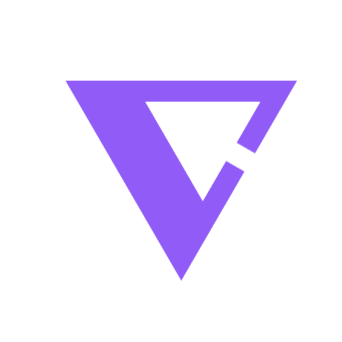
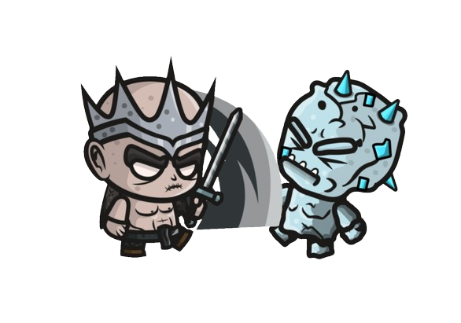
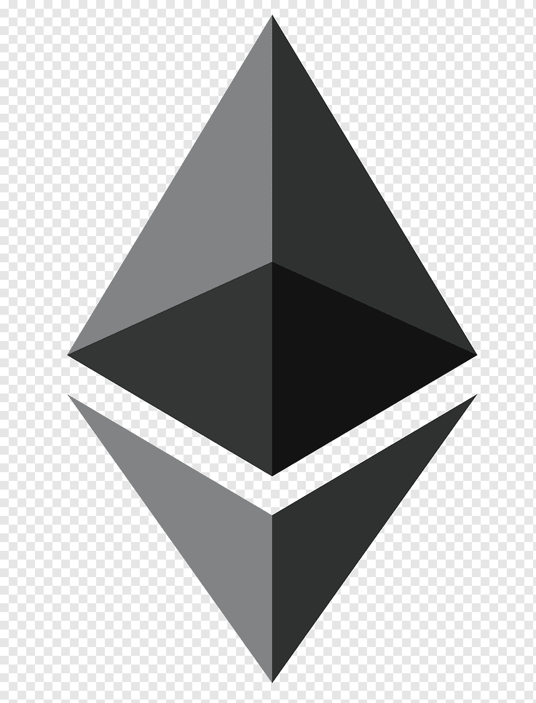
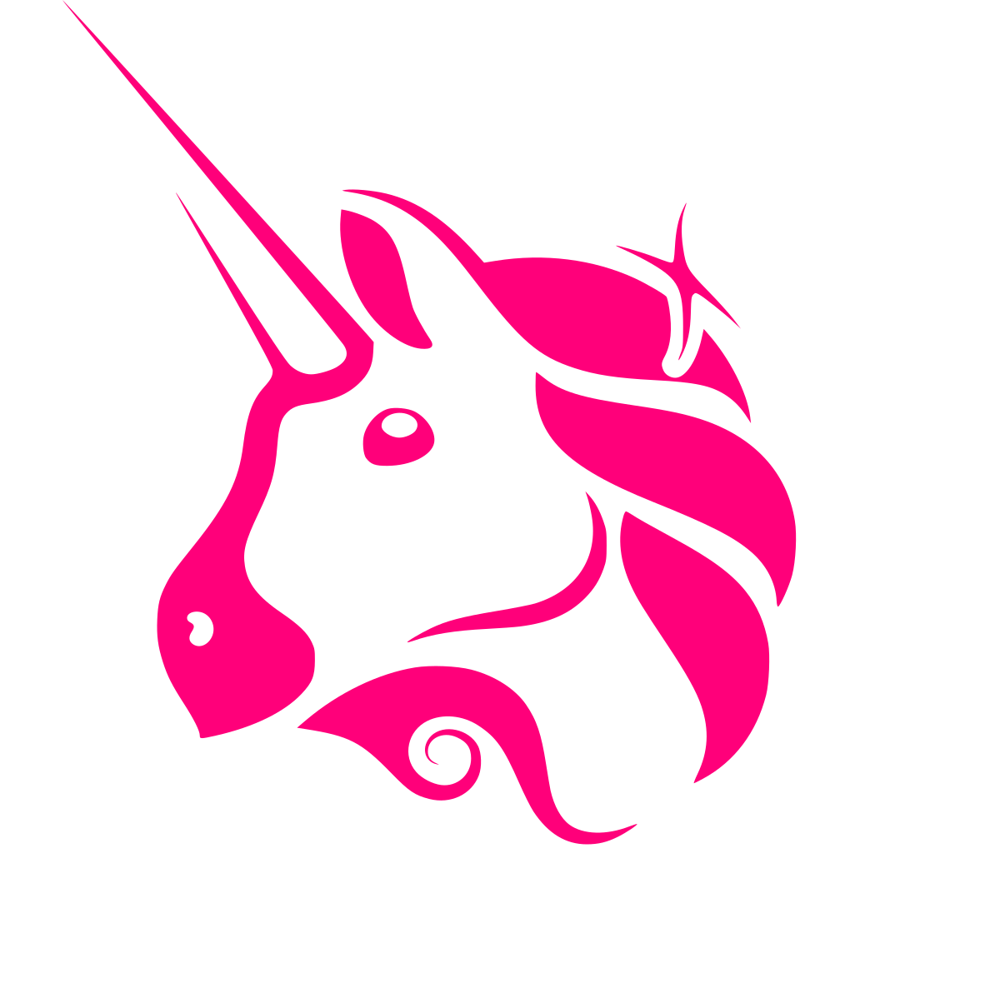
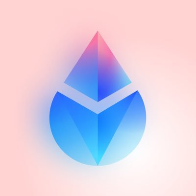
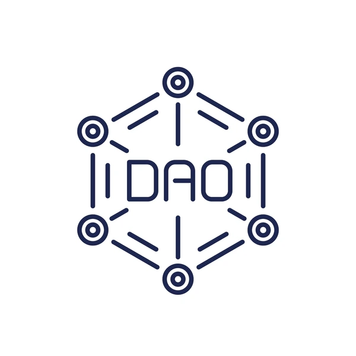
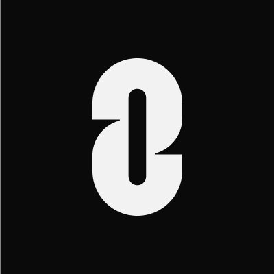
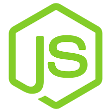

## 👋 Hi there, I'm Lovish

Experienced Backend Developer with expertise in Microservices, Distributed Systems and Blockchain Engineering. Passionate about building innovative solutions and pushing the boundaries of web3.

###

  
  
  
  
  
  
  
  
  
  
  
  
  
  
  
  
  
  
  

 

###

🔗 Blockchain Dev

## My Hackathon Winner Projects 🏆

  <table>
    <tr>
      <td onclick="window.open('https://ethglobal.com/showcase/zk-credit-score-pa7r4', '_blank')" style="cursor:pointer;">
        <a href="https://ethglobal.com/showcase/zk-credit-score-pa7r4" target="_blank" style="text-decoration:none; color:inherit;">
          

            
            

              ZK Credit Score 
              ETHGlobal Bangkok
            

          

        </a>
      </td>
      <td onclick="window.open('https://ethglobal.com/showcase/repo-rewards-su0bh', '_blank')" style="cursor:pointer;">
        <a href="https://ethglobal.com/showcase/repo-rewards-su0bh" target="_blank" style="text-decoration:none; color:inherit;">
          

            
            

              Repo Rewards 
              ETHGlobal Superhack
            

          

        </a>
      </td>
      <td onclick="window.open('https://ethglobal.com/showcase/chain-monsters-o26dw', '_blank')" style="cursor:pointer;">
        <a href="https://ethglobal.com/showcase/chain-monsters-o26dw" target="_blank" style="text-decoration:none; color:inherit;">
          

            
            

              Chain Monsters 
              ETHGlobal Starkware
            

          

        </a>
      </td>
    </tr>
  </table>

## Smart Contract Development

  <table>
    <tr>
      <td onclick="window.open('https://ethglobal.com/showcase/zk-credit-score-pa7r4', '_blank')" style="cursor:pointer;">
        <a href="https://ethglobal.com/showcase/zk-credit-score-pa7r4" target="_blank" style="text-decoration:none; color:inherit;">
          

            
            

              ERC-20 LaunchPad Time Vaults
            

          

        </a>
      </td>
       <td onclick="window.open('https://ethglobal.com/showcase/chain-monsters-o26dw', '_blank')" style="cursor:pointer;">
        <a href="https://ethglobal.com/showcase/chain-monsters-o26dw" target="_blank" style="text-decoration:none; color:inherit;">
          

            
            

              UniSwap V3 Implementation
            

          

        </a>
      </td>
      <td onclick="window.open('https://ethglobal.com/showcase/repo-rewards-su0bh', '_blank')" style="cursor:pointer;">
        <a href="https://ethglobal.com/showcase/repo-rewards-su0bh" target="_blank" style="text-decoration:none; color:inherit;">
          

            
            

              4337 Wallet Account Abstraction
            

          

        </a>
      </td>
      <td onclick="window.open('https://ethglobal.com/showcase/zk-credit-score-pa7r4', '_blank')" style="cursor:pointer;">
        <a href="https://ethglobal.com/showcase/zk-credit-score-pa7r4" target="_blank" style="text-decoration:none; color:inherit;">
          

            
            

              Lending Platform Lido
            

          

        </a>
      </td>
      <td onclick="window.open('https://ethglobal.com/showcase/zk-credit-score-pa7r4', '_blank')" style="cursor:pointer;">
        <a href="https://ethglobal.com/showcase/zk-credit-score-pa7r4" target="_blank" style="text-decoration:none; color:inherit;">
          

            
            

              DOA Voting Implementation
            

          

        </a>
      </td>
      <td onclick="window.open('https://ethglobal.com/showcase/zk-credit-score-pa7r4', '_blank')" style="cursor:pointer;">
        <a href="https://ethglobal.com/showcase/zk-credit-score-pa7r4" target="_blank" style="text-decoration:none; color:inherit;">
          

            
            

              Cross-Chain Bridge LayerZero
            

          

        </a>
      </td>
    </tr>
  </table>

## Backend Development
   

  <table>
    <tr>
      <td onclick="window.open('https://ethglobal.com/showcase/zk-credit-score-pa7r4', '_blank')" style="cursor:pointer;">
        <a href="https://ethglobal.com/showcase/zk-credit-score-pa7r4" target="_blank" style="text-decoration:none; color:inherit;">
          

            
            

              Microservices 
              Node.js + Postgres
            

          

        </a>
      </td>
      <td onclick="window.open('https://ethglobal.com/showcase/repo-rewards-su0bh', '_blank')" style="cursor:pointer;">
        <a href="https://ethglobal.com/showcase/repo-rewards-su0bh" target="_blank" style="text-decoration:none; color:inherit;">
          

            
            

              API, WebSockets 
              Golang + Docker
            

          

        </a>
      </td>
      <td onclick="window.open('https://ethglobal.com/showcase/chain-monsters-o26dw', '_blank')" style="cursor:pointer;">
        <a href="https://ethglobal.com/showcase/chain-monsters-o26dw" target="_blank" style="text-decoration:none; color:inherit;">
          

            
            

              Realtime Google Docs 
              Goroutes + Channels
            

          

        </a>
      </td>
    </tr>
  </table>

###

  

###

If you need someone to turn ideas into code or explain blockchain to your gradma, I'm your dev.
